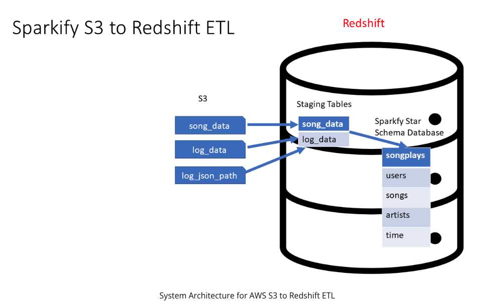
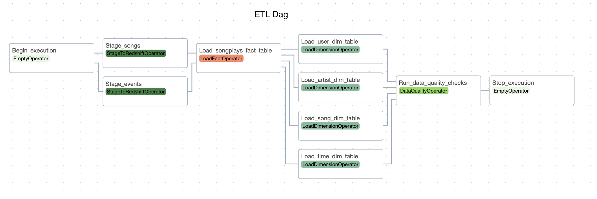

# Data Engineering

## [Data Warehouse](https://github.com/marcusreaiche/de-udacity-nanodegree-project-03)

#### Skills and technologies
> Data extraction • Infrastructure as code (IaC) • Olap cubes • Table design • Cloud computing fluency • ETL • Database fundamentals • AWS storage services • Table partitioning • Online transaction processing • AWS data warehouse • Redshift • Data warehouse architecture • Amazon S3

A fictitious music streaming startup, Sparkify, has grown its user base and song database and wants to move its processes and data onto the cloud. Their data resides in S3, in a directory of JSON logs on user activity on the app, as well as a directory with JSON metadata on the songs in their app.

In this project, I built an ETL pipeline that extracts their data from S3, stages them in Redshift, and transforms data into a set of dimensional tables for their analytics team to continue finding insights into what songs their users are listening to.

More details, including the project's source code, can be found [here](https://github.com/marcusreaiche/de-udacity-nanodegree-project-03).

## [Data Pipelines with Apache Airflow](https://github.com/marcusreaiche/de-udacity-nanodegree-project-05)

#### Skills and technologies
> Apache Airflow • Data pipeline dags • Data pipeline partitioning • Amazon S3 • Data pipeline maintenance • Redshift • Data pipeline creation • Data lineage

In this project, I built an Airflow ETL dag that populates the Redshift data warehouse using log files stored in Amazon S3. This project is a natural extension of the [data warehouse](#data-warehouse) project enabling the schedule of the ETL pipeline.

The dag steps and tasks are depicted below.

More details, including the project's source code, can be found [here](https://github.com/marcusreaiche/de-udacity-nanodegree-project-05).

## [Spark and Data Lakes](https://github.com/marcusreaiche/de-udacity-nanodegree-project-05)

#### Skills and technologies
> AWS data lakes • ELT • Big data fluency • Data wrangling • Amazon s3 • Amazon Athena • Data Lakehouse Architecture • Apache Spark • Data format fundamentals • AWS glue • Data lakes • Data transformation

This project involved working with fictitious data generated by a hardware STEDI Step Trainer that aids users in balance exercises. The device includes sensors that collect data for a machine-learning algorithm to detect steps. A companion mobile app interacts with the sensors and gathers user data. There's substantial interest from early adopters willing to purchase and use the trainers.

Some customers have received and begun using the Step Trainers with the mobile app to test their balance. The device records object distance, while the app uses a phone's accelerometer for motion detection in three directions.

The goal is to utilize the motion sensor data to train a real-time machine learning model for step detection, prioritizing user privacy by using data only from consenting customers.

In this project I extracted the data produced by the STEDI Step Trainer sensors and the mobile app, and curated them into a data lakehouse solution on AWS so that Data Scientists and ML engineers could train the learning model. One important aspect of the project was to remove all PII from the trusted-zone tables.

More details, including the project's source code, can be found [here](https://github.com/marcusreaiche/de-udacity-nanodegree-project-04).

